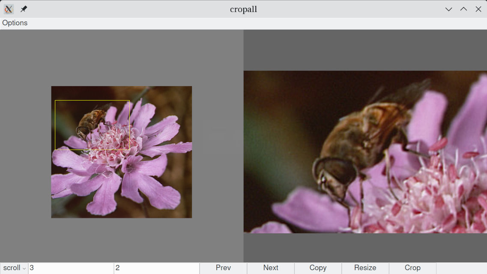

# cropall

This version of cropall differs from the original source (pknowles/cropall:main) by adding an option to append a suffix to the output file.

Appending a suffix eases workflow and increases data safety by: 
1. Making it easier to distinguish cropped images from the originals by file name alone.
2. Allowing output images to be saved in the same folder as input images, without clobbering the input file. This was not possible in the previous version.
3. Proecting the original file. Destruction of the input file is made impossible by removing any possibility of an accidental overwrite.

NOTE: This feature is disabled by default. It can be enabled by changing the config file entry "append_suffix" from False to True. The default suffix is "-crop"; it can be changed by editing the value of "output_suffix" in the config file.

------------------------------------------------------------------------------------------------------------------------------------------------------

A small cross-platform python script to interactively crop and resize lots of
images images quickly. Image editors like gimp take way too long to start, open
an image, crop it, export it. A batch job/script can automate it but everything
gets cropped at the same positions. This app sits in the middle, automating
loading/clicking crop/save/next so your amazing human vision can be used to
quickly select what needs to be cropped and not wasted on navigating clunky GUI
hierarchies.

This is really a minimal GUI and preview for the following imagemagick command:

    convert in.jpg -crop <region> -resize <fit> out.jpg

This script actually uses imagemagick under the hood for its fast and high
quality resampling algorithms. The GUI shows a quick and low quality preview.

## Controls

Select the source directory to process. By default results are written to a
`crops` subdirectory.

- space - crop and advance to the next image
- left/right - previous/next image
- click - move the selection, or drag to box-select depending on the mode (hold
  shift to move the box-select)
- scroll - adjust crop size when using scroll mode (hold shift for small
  adjustments)



Buttons:

- Copy - copy the source image file to the output directory (no crop/resize)
- Resize - shrink the image to the smaller of the given width or height, keeping aspect ratio
- Crop - crop the image to match the region shown in the preview, also resizing
  if the option is selected

## Install

Download a pre-built from the
[releases](https://github.com/pknowles/cropall/releases) section on github.
These are self contained packages created with pyinstaller.

Alternatively, grab the source and dependencies. I hope it's simple enough that
people with a little python experience can adapt it as needed.

```
git clone https://github.com/pknowles/cropall.git
cd cropall
python -m venv .venv

# linux
. .venv/bin/activate

# windows
. .venv/Scripts/Activate

pip install -r requirements.txt
python cropall.py

# Install ImageMagick https://docs.wand-py.org/en/latest/guide/install.html
# E.g.:

# Ubuntu
sudo apt-get install libmagickwand-dev

# Fedora
sudo dnf install ImageMagick-devel

# Windows (make sure to match python x86 or x64)
# Download dll from: https://imagemagick.org/script/download.php#windows

# Optional: create the standalone binary distribution
pyinstaller cropall.spec
```
## License

The python source code here is under GPL v3.

```
This program is free software: you can redistribute it and/or modify
it under the terms of the GNU General Public License as published by
the Free Software Foundation, either version 3 of the License, or
(at your option) any later version.

This program is distributed in the hope that it will be useful,
but WITHOUT ANY WARRANTY; without even the implied warranty of
MERCHANTABILITY or FITNESS FOR A PARTICULAR PURPOSE.  See the
GNU General Public License for more details.

You should have received a copy of the GNU General Public License
along with this program.  If not, see <http://www.gnu.org/licenses/>.
```

### Third party code

Pre-built binaries of ImageMagick are included with the distribution. See:
https://imagemagick.org/script/license.php

The release distribution includes various scripts and binaries collected by
`pyinstaller`. Licenses found in the venv directory are included by
`cropall.spec`.
